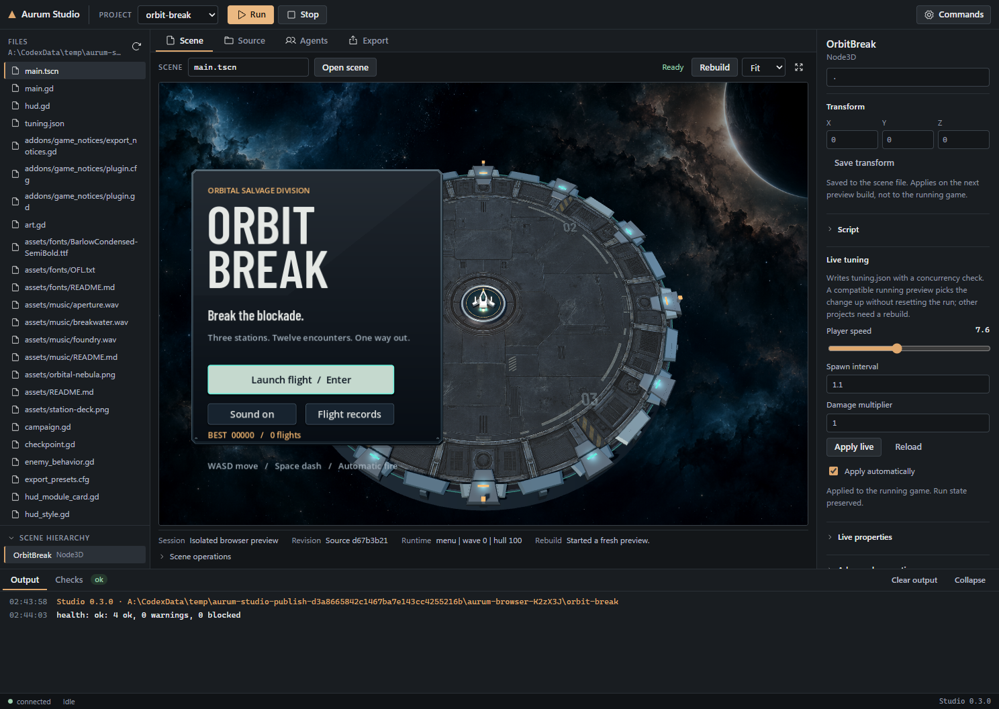
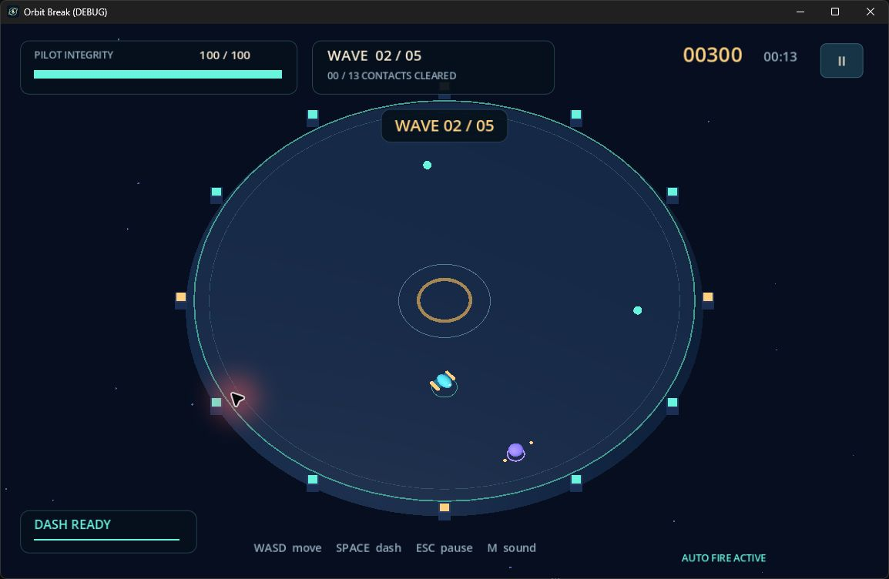
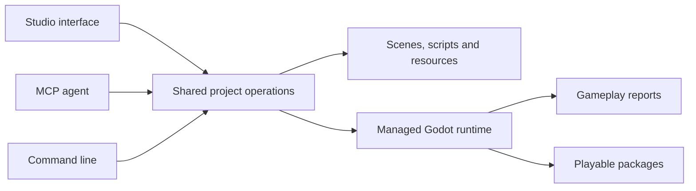

# Aurum Studio

A local game-development workspace for people and agents. Edit scenes and code, play inside the workspace, tune the running game, and export a browser or Windows build.

Godot 4.7 handles rendering and resources underneath. Aurum owns the project workflow, the local interface, and the agent-facing operations. You do not need to keep a Godot editor open. Use GDScript for gameplay and Rust GDExtensions when native code is useful.

[Download v0.3.0](https://github.com/AG064/aurum-studio/releases/tag/v0.3.0) · [Get started](#get-started-on-windows) · [Play the example](#a-game-you-can-run) · [Connect an agent](#headless-by-design) · [Documentation](#documentation)



The screenshot shows the development branch's redesigned workbench. The downloadable v0.3.0 package predates this interface; build the current source for the updated Studio and 3D example.

## What you can do

| Workflow | Available today |
| --- | --- |
| Create and edit | Runnable 2D/3D starters, scene hierarchy, node properties, scripts, resources, persistent drafts and undo |
| Work with agents | Standard local MCP, CLI and HTTP using the same project operations; runtime class and property discovery |
| Test real gameplay | Explicit test scenes, bounded runs, game arguments, fixed simulation rate and required JSON verdicts |
| Play in the workspace | Isolated WebAssembly previews, source freshness, live properties and checkpoint-based rebuilds |
| Iterate safely | Hash-checked saves, transactional scene edits, failed-build preservation and managed previews |
| Ship a game | Standalone browser bundles, portable Windows packages, configurable presets for six export targets |
| Use native code | Rust extension builds, atomic library installation and explicit reload boundaries |

No model subscription, provider account or API key is built into Aurum. Bring your preferred MCP-compatible agent. Project operations run locally; HTTP control stays on loopback with a session token.

## A game you can run

**[Orbit Break](examples/orbit-break)** is an orbital survival campaign across twelve encounters and three stations. Choose Kestrel, Bastion or Relay, recover cargo, protect reactors, hold transmission windows and defeat three distinct bosses. Pulse fire, piercing Lance rounds and chain-lightning Arc support different builds. Between encounters, choose one of three modules. Flight records, discovered contacts, commendations and three original music arrangements are saved or bundled locally.



The example has **85 gameplay and HUD checks**, five winning campaign scenarios covering every weapon and flight frame, and a stationary mission-failure check. Browser tests exercise actual export, keyboard play, three-choice upgrades, live tuning, save/undo and isolation. [Verification scope](docs/WEB_PREVIEW.md#verification) distinguishes current native evidence from earlier browser results and device testing.

After installing Aurum, from this repository:

```powershell
aurum studio ./examples/orbit-break
# Click Run in Studio for browser play, or launch a native window:
aurum run ./examples/orbit-break
```

To test and produce a standalone Windows package, without running tests in the source tree:

```powershell
pwsh ./examples/orbit-break/tools/verify.ps1 -Package `
  -OutputDirectory ./examples/orbit-break/dist/windows
```

Then open `examples/orbit-break/Play Orbit Break.vbs`. See the [example guide](examples/orbit-break/README.md) for controls and runtime configuration. Generated game binaries are not checked into Git.

### Browser play and live editing

Provision the pinned web templates once. The script verifies the official archives before extraction:

```powershell
pwsh ./scripts/provision-godot.ps1 -Destination A:/AurumStudio/runtime -Mode WebTemplates
aurum studio ./examples/orbit-break
```

Use **Run** to play in the workspace. **Live tuning** and the **Runtime inspector** apply supported values without restarting the game. Script and scene edits can rebuild automatically with a checkpoint of the running state. Failed replacements retain the previous game. Untouched values follow new blueprint defaults; changed runtime values are preserved. [Editing and checkpoint boundaries](docs/INTEGRATION.md).

**Export > Export browser game** creates a fresh standalone bundle under `dist/web`, preserving the selected project preset and legal notices. Players need a WebGL 2 browser, not Rust, Godot or Studio. Rust extensions use a separate Web build profile and require isolation headers; script-only games do not. No hosting service is enabled automatically. [Web setup](docs/WEB_PREVIEW.md) and [Rust Web builds](docs/RUST_WEB.md).

## Get started on Windows

For the prebuilt release, download the Windows Studio ZIP, extract it into a writable folder and open `Launch Aurum Studio.vbs`. The Godot runtime and Web templates are included. Script-only projects need no Rust compiler or separate editor installation. [Packages, checksums and optional Rust setup](docs/RELEASES.md).

To build from source:

Prerequisites: PowerShell 7, Rust with the Windows C++ build tools, and the full **Godot 4.7 Windows executable**, not the small console launcher. Source builds were verified with Rust 1.98. The installer copies the runtime so subsequent use does not require a separate engine installation.

```powershell
git clone https://github.com/AG064/aurum-studio.git
cd aurum-studio
pwsh ./scripts/install.ps1 `
  -GodotBinary C:/Tools/Godot_v4.7-stable_win64.exe `
  -StudioHome "$env:LOCALAPPDATA/AurumStudio"
```

Open **Aurum Studio** from Start. In a new terminal, `aurum` opens the same workspace. The installer preserves projects and state, backs up replaced binaries, and supports `-WhatIf`. Building the application needs Rust; using the script-only project starters does not.

```powershell
aurum new C:/Projects/MyGame --template 3d
aurum studio C:/Projects/MyGame
aurum dev C:/Projects/MyGame --play
```

`dev` is headless by default. `--play` adds a managed game preview; `--editor` opens the optional native editor. See [getting started](docs/GETTING_STARTED.md) for the native Rust template and existing-project import.

## Headless by design

The compact MCP profile exposes three tools: `aurum_project_query`, `aurum_project_action` and `aurum_mcp_status`. Agents discover the installed runtime's classes instead of depending only on remembered engine APIs.

The development tree adds `op=describe` for on-demand operation schemas and structured MCP results. [Relay Yard: Night Shift](examples/relay-yard) is a small native/Web 3D action-extraction game with imported assets, combat, a Warden encounter, live values, combat-state checkpoints and standalone packaging. These additions are not part of the published 0.3.0 ZIP. See [agent workflows](docs/AGENT_WORKFLOWS.md).

```json
{
  "mcpServers": {
    "aurum": {
      "command": "aurum",
      "args": ["mcp", "--root", "C:/Projects/MyGame", "--tools", "studio"]
    }
  }
}
```

Use the absolute executable path if the client does not inherit your terminal's PATH. Add `--read-only` to withhold writes. Client configuration is changed only when you explicitly request installation.

The same test can run through MCP, Studio or the CLI:

```json
{
  "op": "play",
  "scene": "tests/acceptance.tscn",
  "frames": 120,
  "fixed_fps": 60,
  "user_args": ["--acceptance"],
  "report": true
}
```

A required verdict must be freshly written by the game. Missing reports, false verdicts, runtime errors and timeouts fail the operation. For tests that modify files, use a disposable project copy as the example verifier does. [Agent operations and report contract](docs/AGENT_PLAYTESTS.md).



`--tools all` additionally exposes procedural content and the Rust simulation tools. The simulation is a separate session, not a connection to a running game's memory. Running a project executes its scripts and native code with your permissions; the tool boundary is not an operating-system sandbox.

## What reloads, and what does not

Studio stays open while you work. Game-managed data, such as Orbit Break's tuning, can reload without losing the current run. Compatible native implementation changes can reload in the editor, and failed builds preserve the working library.

Script and scene changes use validated, checkpoint-based preview rebuilding with a retained fallback. Supported properties apply live. Native registration or schema changes can require a controlled editor restart. **Universal zero-restart development is not claimed.** [Runtime integration](docs/INTEGRATION.md).

## Platform status

Windows is the verified desktop and portable-game target. Orbit Break also runs in a Chromium WebAssembly preview and exports as a standalone web bundle. Rust previews use an explicit Emscripten side-module build and compatible extension templates. See [Rust Web requirements](docs/RUST_WEB.md). Presets can be configured for Windows, Linux, macOS, Web, Android and iOS; a preset is not a verified device build.

Mobile and headset delivery have not been device-tested. The Rust VR and text modules remain placeholders. Aurum uses the existing Godot backend rather than a maintained engine fork. [Current status and boundaries](docs/STUDIO_STATUS.md).

## Verify and contribute

The full local gate copies the working tree to a temporary location before running tests:

```powershell
pwsh ./scripts/tests/verify_studio.ps1 `
  -GodotBinary C:/Tools/Godot_v4.7-stable_win64.exe `
  -NativeReload -ReleaseInstall
```

Add `-Offline` when Cargo dependencies are already cached. The gate covers strict Rust tests, formatting, Clippy, real scene persistence, headless gameplay, editor undo/redo, native reload recovery and a temporary installation. [Contributing](CONTRIBUTING.md).

## Documentation

- [Getting started](docs/GETTING_STARTED.md)
- [Daily workflow and project operations](docs/WORKFLOW.md)
- [Headless testing and platform exports](docs/AGENT_PLAYTESTS.md)
- [Architecture](docs/ARCHITECTURE.md)
- [Verification record](docs/DELIVERY.md)
- [Browser preview and acceptance tests](docs/WEB_PREVIEW.md)
- [Design decisions](docs/DESIGN.md)
- [Status and limitations](docs/STUDIO_STATUS.md)
- [Engine modules](docs/MODULES.md)

The engine workspace also includes ECS, state/events, 2D/3D helpers, space flight, visual-novel interpretation and procedural content libraries. The original PowerShell helpers remain available for existing automation.

[MIT licensed](LICENSE). Portable game packages include the underlying runtime's license and third-party notices. Screenshots show the working application and included example; the banner is a repository-native SVG.
