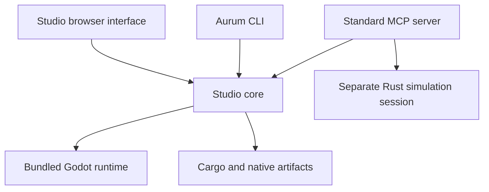

# Aurum Studio architecture

`aurum-studio-core` owns project discovery, guarded files, native builds, process ownership, development watching, and headless project operations. `aurum-cli`, `aurum-studio-server`, and the project tools in `aurum-mcp` call that shared implementation.

## Execution

Headless scene operations start bounded runtime workers with a JSON request. They work on a detached scene, stage the resulting resource, and return a structured result. The parent commits only a successful result against the expected previous file hash. Validation checks imports and resource/script loading. Gameplay tests run for a bounded frame count.

Studio's supervisor serializes commands and reports events to the interface. A project build lock coordinates callers. Native artifacts are verified before atomic replacement. The watcher remembers previous source declarations and reports the reason for reload or restart.

## Optional live editor

`aurum-editor` supplies the native bridge. Its GDScript adapter supplies the current editor scene and records mutations in `EditorUndoRedoManager`. Nodes receive scene ownership so they survive serialization. Requests and responses are published atomically; claimed requests are not blindly replayed. A recent heartbeat distinguishes a configured directory from a responsive editor.

## Agent surfaces

The Studio MCP profile exposes two project tools and a status tool. The full profile also exposes procedural content and a separate in-memory Rust engine session. Those runtime tools do not silently target a running game's memory.

Runtime class/property/method discovery comes from the installed Godot build. Agents can edit scripts, validate them, inspect persisted scenes, and observe bounded gameplay through Aurum without launching a visible editor.

## Engine libraries

The existing engine libraries remain: `aurum-core`, `aurum-2d`, `aurum-3d`, `aurum-space`, `aurum-vn`, `aurum-content`, and the `aurum-godot` adapter. Godot owns rendering, resource imports, and its scene tree. Aurum's typed and dynamic simulation models remain distinct where existing modules use them.

## Distribution

The Windows installer copies the verified application and full runtime, preserves state, and retains previous binaries for recovery. Studio is launched by its own shortcut. Portable game packages contain an executable runtime, PCK, required native libraries, and license notices.

All control endpoints remain local. Running project code uses the current user's permissions; this is a development environment, not a sandbox for untrusted programs.
