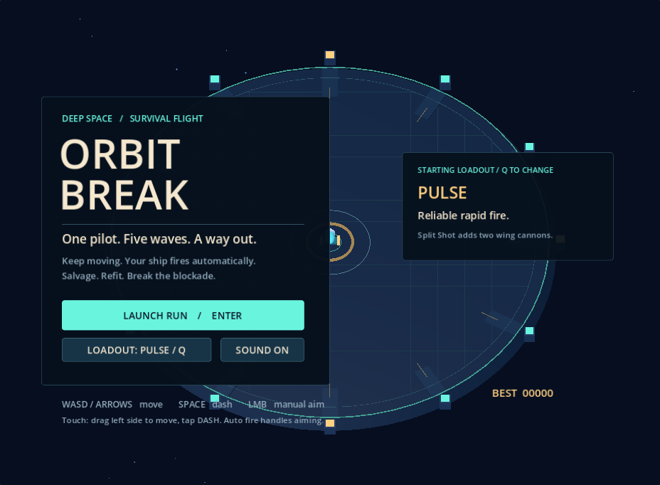
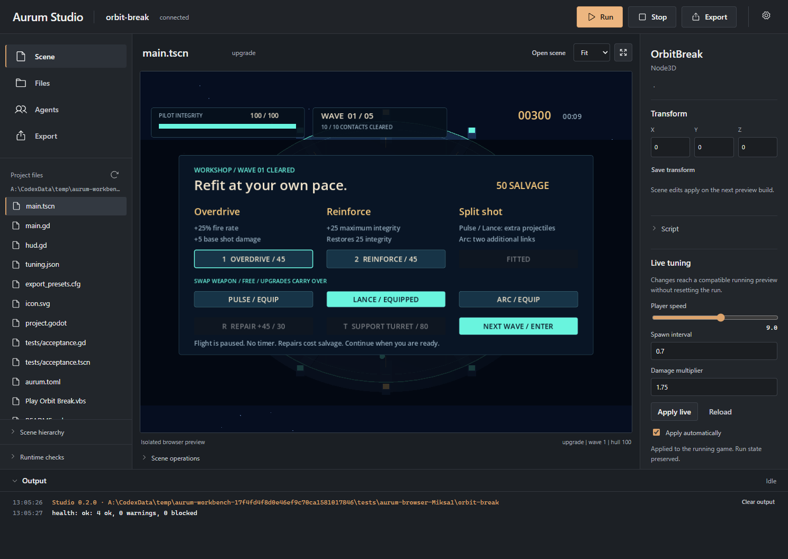

# Orbit Break

A browser-playable 3D survival game built through Aurum's project operations. Survive five waves, spend salvage in a paused workshop and defeat the three-phase Warden. The game uses procedural geometry and generated sound effects, with no asset download or model service required.



## Play from source

Install [Aurum Studio](../../README.md#get-started-on-windows), then run these commands from the repository root:

```powershell
aurum studio ./examples/orbit-break
aurum run ./examples/orbit-break
```

The first command opens the workspace. The second launches the game directly. Neither requires a visible Godot editor.

For browser play, provision the matching [web templates](../../docs/WEB_PREVIEW.md), then press **Run** in Studio. **Export browser game** produces a standalone bundle for an HTTP(S) host. Rust and Studio are not required on the player's machine.

| Control | Action |
| --- | --- |
| WASD or arrow keys | Move |
| Space | Dash with brief invulnerability; 2.2-second cooldown |
| Left mouse, held | Manual aim; otherwise targeting and firing are automatic |
| Escape | Pause or resume |
| 1, 2, 3 | Buy a workshop upgrade |
| Q | Cycle weapon in the menu or workshop |
| R / T | Buy a repair / support turret in the workshop |
| Enter | Start, retry or leave the workshop |
| M | Toggle sound |
| Touch | Drag the left side to move; tap DASH |

The run also pauses when focus is lost. Scores and sound preference stay on your machine. Touch input handling is covered by synthetic events; Android/iOS device behavior is not yet verified.

## Build choices

- Pulse fires quickly; Split Shot adds two wing projectiles.
- Lance trades rate of fire for damage and pierces up to three contacts per projectile.
- Arc chains through nearby contacts with diminishing damage. Split Shot extends it from three links to five.
- Overdrive increases fire rate and base damage. Reinforce raises maximum hull and restores 25 integrity. Each upgrade can be bought once per workshop; weapons can be swapped free.
- Repairs restore 45 integrity for 30 salvage. A support turret costs 80 salvage and persists until the end of the run.

The workshop never advances on a timer and does not heal the player for free. The Warden changes attack patterns at two-thirds and one-third hull. Expanding enemy rings warn of shots; marked red areas give 1.4 seconds to move before a strike.



## Build a portable game

From the repository root:

```powershell
pwsh ./examples/orbit-break/tools/verify.ps1 -Package `
  -OutputDirectory ./examples/orbit-break/dist/windows
```

The verifier finds the runtime beside an installed Aurum executable or under `AURUM_STUDIO_HOME`. Override it when using a development build:

```powershell
pwsh ./examples/orbit-break/tools/verify.ps1 `
  -AurumBinary ./target/debug/aurum.exe `
  -GodotBinary C:/Tools/Godot_v4.7-stable_win64.exe `
  -Package -OutputDirectory ./examples/orbit-break/dist/windows
```

Tests and packaging run in a disposable copy with isolated user data. Only after all checks pass is the package copied to the requested, previously nonexistent destination and hash-checked. The script refuses to overwrite an earlier build. Omit `-OutputDirectory` to retain the package only in the temporary verification directory.

Open **Play Orbit Break.vbs**, or launch **dist/windows/game.exe**. Keep the PCK and notices beside the executable. The package includes the full Windows runtime and needs no separate engine installation. Generated packages and local state are excluded from Git.

## Agent and test contract

```powershell
aurum mcp --root ./examples/orbit-break --tools studio
```

The standard MCP profile provides project queries, project actions and status. It can read runtime classes, edit scenes and code, validate, run tests and package the project without an open editor.

On a disposable project copy, run the acceptance scene with:

```json
{"op":"play","scene":"tests/acceptance.tscn","frames":120,"fixed_fps":60,"user_args":["--acceptance"],"report":true}
```

There are 47 gameplay checks covering input, combat, purchases, pause, weapon identities, boss phases, telegraph timing, victory/defeat, restart and live tuning. The deterministic suite directly drives state transitions. Separate `--autoplay --weapon 0`, `--weapon 1`, `--weapon 2` and `--idle-test` campaigns exercise the ordinary game loop without changing base player statistics: all three moving builds win, standing still loses. A browser suite additionally uses real keyboard input and checks the live inspector's round trip. [Verification scope](../../docs/WEB_PREVIEW.md#verification).

## Edit without restarting

Change `godot/tuning.json`, or use Studio's live inspector. Valid player-speed, spawn-interval and damage-multiplier changes preserve the run. Native previews read the file twice per second; browser previews receive it through an isolated, acknowledged bridge. Invalid tuning retains the last valid values.

This is game-managed data reload, not arbitrary state-preserving code replacement. Script/scene edits use Aurum's validated preview restart. The packaged PCK is not an editable source directory.

## Scope

Windows native play and Chromium browser play are verified. Other browsers and device targets need separate testing. This is not a VR port: headset controls, an XR rig, comfort design and device performance need separate work. Studio's preview polls a local tuning endpoint; standalone play uses no Studio bridge or telemetry. Its scripts, geometry, sounds and SVG icon are covered by the repository's [MIT license](../../LICENSE).
