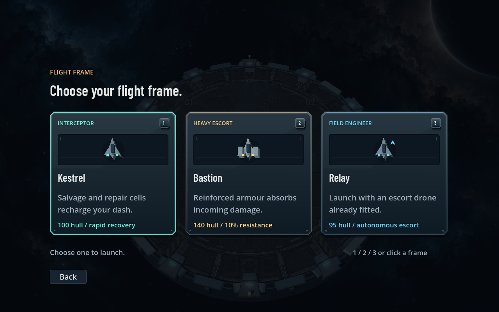

# Orbit Break

A 3D orbital survival campaign built through Aurum's project operations. Twelve
authored encounters take you through Breakwater Dock, Aperture Relay and Ash
Foundry. Recover cargo, protect reactor cores, survive transmission windows and
break three boss blockades. Choose one of three modules at every workshop stop.
Artwork, display type and music are bundled; playing needs no asset service or
model account.


## Play from source

Install [Aurum Studio](../../README.md#get-started-on-windows), then run these commands from the repository root:

```powershell
aurum studio ./examples/orbit-break
aurum run ./examples/orbit-break
```

The first command opens the workspace. The second launches the game directly. Neither requires a visible Godot editor.

For browser play, provision the matching [web templates](../../docs/WEB_PREVIEW.md), then press **Run** in Studio. **Export browser game** produces a standalone bundle for an HTTP(S) host. Rust and Studio are not required on the player's machine.

| Control | Action |
| --- | --- |
| WASD or arrow keys | Move |
| Space | Dash with brief invulnerability; 2.2-second cooldown |
| Left mouse, held | Manual aim; otherwise targeting and firing are automatic |
| Escape | Pause or resume |
| 1, 2, 3 or click | Choose a frame or one of the three offered upgrades |
| Enter | Open the hangar, launch the remembered frame, or retry |
| M | Toggle sound |
| Touch | Drag the left side to move; tap DASH |

The run also pauses when focus is lost. Scores and sound preference stay on your machine. Touch input handling is covered by synthetic events; Android/iOS device behavior is not yet verified.

## Three choices, one upgrade

The workshop always shows exactly three cards. Choose one and the next wave begins with a short spawn grace period. There is no currency, separate weapon picker, repair shop or extra Continue button. The game stays paused until a choice is made.

You start with Pulse. The first stop offers Split Battery, Lance Array or Arc Conductor. New weapons arrive through the same choice flow as other upgrades.

- Pulse's Split Battery adds two wing shots and 25% damage. Subsequent Pulse evolution adds 25% fire rate and damage.
- Lance trades fire rate for 2.8x per-hit power and three-target piercing. Rail Accelerator adds two more pierces and 40% damage.
- Arc chains through three nearby contacts. Chain Reaction adds two links and 35% damage.
- Repair Weave restores up to 55 integrity and raises maximum hull by 30.
- Wingman adds a following escort drone. Shock Drive makes dashes damage nearby enemies and shortens their cooldown by 25%.

## Campaign and flight frames

Kestrel launches with 100 hull and recovers dash charge from pickups. Bastion
has 140 hull and 10% damage resistance. Relay has 95 hull and starts with a
light escort drone. Choose a frame in the hangar with 1, 2 or 3, or click it.
Enter selects the remembered frame. Their traits change the run without locking
weapons behind a menu.

| Station | Encounters | Main threats |
| --- | --- | --- |
| Breakwater Dock | Departure clearance, Loose cargo, Dockside hold, Gatekeeper | Pursuit patrols, recovered caches, a vulnerable reactor and rotating boss volleys |
| Aperture Relay | Signal intercept, Dead air, Black-box recovery, Carrier | Strafing interceptors, cycling frontal shields, timed holds and deployed escorts |
| Ash Foundry | Hot approach, Containment breach, Last transmission, Warden | Vent lanes, bombardment, drifting mines, reactor defense and overlapping boss marks |

Clear encounters end after the planned patrol is defeated. Recovery also
requires all three caches before a two-minute lockdown. Defense fails if the
reactor is destroyed. Hold encounters must complete both the timer and the
patrol. The Gatekeeper, Carrier and Warden have different attacks and three
health phases each. Their visible circle and lane boundaries match damage areas.

Sentinels block most frontal projectile damage during their guard cycle; flank
them, wait for an opening or use Arc. Interceptors strafe and rush, Bombardiers
mark strikes, and drift mines arm at close range. The pause menu lists fitted
modules. Flight Records keeps the last five sorties, best score, discovered
contacts and four commendations. Invalid save values are bounded on load;
updates replace the prior record through a temporary file.



## Build choices

The larger pool has fifteen module or weapon choices. Ion Bloom turns nearby
kills into area damage, a Breech Capacitor charges the next volley after a dash,
and Storm Lattice lets Arc links recover hull. Composite Plating, repair nanites,
an upgraded escort, salvage tethers and vector thrusters support other routes.
Capped effects leave the offer pool. Boss salvage grants stronger choices after
each station blockade, with exactly three cards and no extra purchase controls.


## Presentation

The arena uses a weathered industrial deck and layered space artwork, with real 3D station structures, bevelled ship silhouettes, directional lighting, shadows and 2x MSAA. Ships and effects remain actual rendered game objects, not screenshots.

Combat has thruster trails, muzzle flashes, impact sparks, expanding explosions, a shield response to damage, elongated Lance rounds and branching Arc beams. The particle system is bounded to 192 pooled instances and 32 flash/ring effects. Weapon sounds are locally synthesized with distinct attacks and controlled mix levels. Browser reduced-motion preferences disable camera shake and nonessential card fades.

The HUD uses framed metal-and-glass instrument housings, inset gauges and shaded equipment illustrations. Barlow Condensed gives titles and instrument values a distinct display style; normal text keeps the bundled fallback font. Hull, armament and dash charge share one cluster; wave progress and score sit opposite it, leaving the center clear. Damage leaves a brief amber gauge trail, disabled with reduced motion. Workshop modules retain exactly three choices, visible shortcuts and hover/keyboard-focus feedback.

The perspective camera preserves the arena's full movement boundary in portrait and compact layouts. The backdrop covers the viewport without stretching its artwork. Raised perimeter armour, structural ribs, a recessed reactor lens, stencilled pad numbers, layered ship hulls and contact shadows give the scene depth. Directional warm/cool lighting and textured surface normals reveal those forms. The station armour is merged into a single static mesh. Ship banking is visual only and respects reduced motion. Physical mobile devices are not yet certified. [Artwork provenance and prompts](godot/assets/README.md), [display font and license](godot/assets/fonts/README.md).

## Build a portable game

From the repository root:

```powershell
pwsh ./examples/orbit-break/tools/verify.ps1 -Package `
  -OutputDirectory ./examples/orbit-break/dist/windows
```

The verifier finds the runtime beside an installed Aurum executable or under `AURUM_STUDIO_HOME`. Override it when using a development build:

```powershell
pwsh ./examples/orbit-break/tools/verify.ps1 `
  -AurumBinary ./target/debug/aurum.exe `
  -GodotBinary C:/Tools/Godot_v4.7-stable_win64.exe `
  -Package -OutputDirectory ./examples/orbit-break/dist/windows
```

Tests and packaging run in a disposable copy with isolated user data. Only after all checks pass is the package copied to the requested, previously nonexistent destination and hash-checked. The script refuses to overwrite an earlier build. Omit `-OutputDirectory` to retain the package only in the temporary verification directory.

Open **Play Orbit Break.vbs**, or launch **dist/windows/game.exe**. Keep the PCK and notices beside the executable. The package includes the full Windows runtime and needs no separate engine installation. Generated packages and local state are excluded from Git.

## Agent and test contract

```powershell
aurum mcp --root ./examples/orbit-break --tools studio
```

The standard MCP profile provides project queries, project actions and status. It can read runtime classes, edit scenes and code, validate, run tests and package the project without an open editor.

On a disposable project copy, run the acceptance scene with:

```json
{"op":"play","scene":"tests/acceptance.tscn","frames":120,"fixed_fps":60,"user_args":["--acceptance"],"report":true}
```

There are 85 gameplay and HUD checks covering the three-card contract, frame
selection, all twelve encounters, cache collection and expiry, reactor damage,
pause, shield openings, boss helpers, lane geometry, charged shots, area damage,
atomic save/load, cleanup, live tuning and camera framing. Five ordinary campaign
scenarios cover Pulse/Lance/Arc and all flight frames, using normal player stats:
each wins all three bosses and recovers the full manifest. Standing still fails
the recovery objective. The moving scenarios take about four to six simulated
minutes, excluding time spent choosing workshop modules; this is not a human
playtime or performance benchmark. [Verification scope](../../docs/WEB_PREVIEW.md#verification).

The original instrumental score has a shared four-bar motif with a separate
arrangement for each station. Menus lower its level and mute affects music and
effects. [Music sources](godot/assets/music/README.md) include a reproducible
generator. Native runtime checks cover playback, looping, mute and resume.

## Edit without restarting

Change `godot/tuning.json`, or use Studio's live inspector. Valid player-speed, spawn-interval and damage-multiplier changes preserve the run. Native previews read the file twice per second; browser previews receive it through an isolated, acknowledged bridge. Invalid tuning retains the last valid values.

This is game-managed data reload, not arbitrary state-preserving code replacement. Script/scene edits use Aurum's validated preview restart. The packaged PCK is not an editable source directory.

## Scope

Windows native play and Chromium browser play are verified. Other browsers and device targets need separate testing. This is not a VR port: headset controls, an XR rig, comfort design and device performance need separate work. Studio's preview polls a local tuning endpoint; standalone play uses no Studio bridge or telemetry. Its scripts, geometry, sounds and SVG icon are covered by the repository's [MIT license](../../LICENSE).
