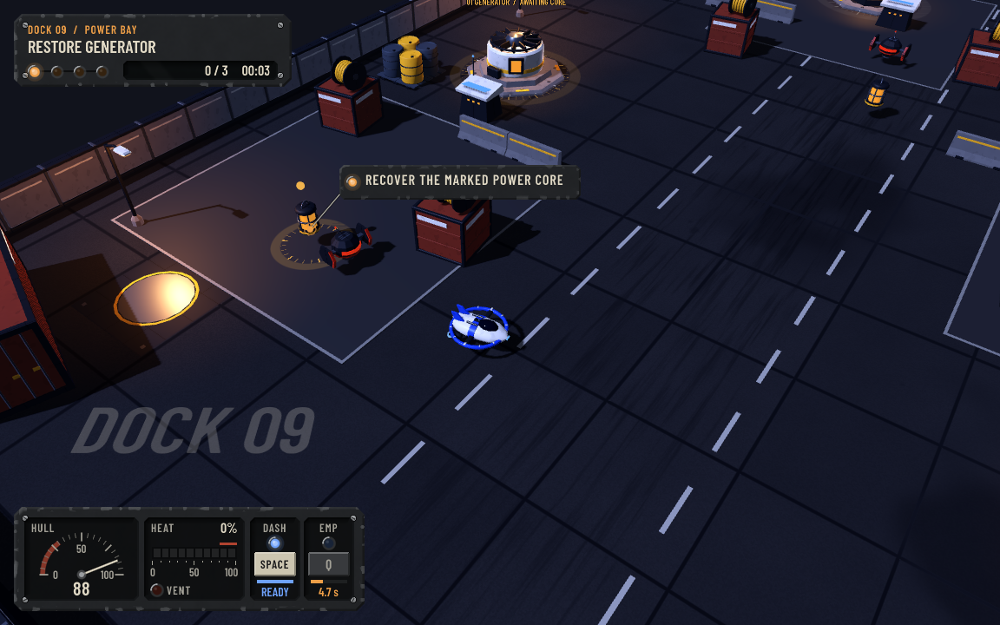
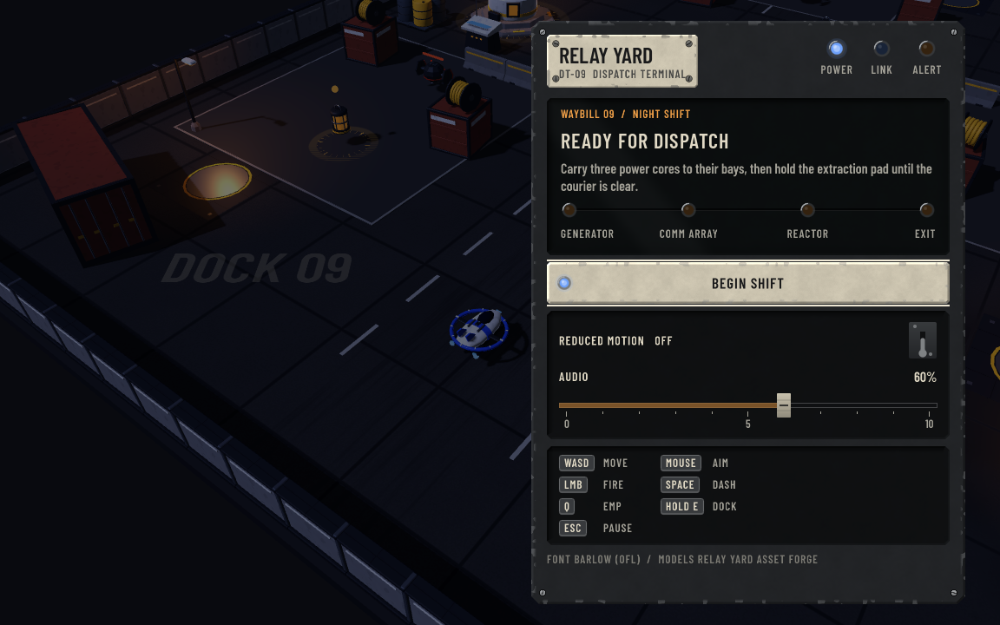

# Relay Yard: Night Shift

A small 3D action-extraction game built through Aurum. Pilot a hover courier through an orbital service dock, carry three cores to their machinery bays, and fight your way through extraction. There is one complete mission, with a beginning, escalating encounters, a Warden fight, victory, failure and retry.





## Play

```powershell
aurum studio ./examples/relay-yard
# Run inside Studio, or open the native game:
aurum run ./examples/relay-yard
```

For the packaged Windows game, extract its folder and open `Play Relay Yard.vbs`. No separate Godot installation is needed by the player. The standalone browser bundle needs HTTP(S) hosting and a WebGL 2 browser. It does not require Studio, Rust or an agent.

| Input | Action |
| --- | --- |
| WASD / arrows | Move relative to the camera |
| Mouse | Aim |
| Left mouse | Fire the heat-limited blaster |
| Space | Dash, with a brief damage-protection window |
| Q | EMP pulse, interrupting nearby drones |
| Hold E | Secure a core or connect it at its marked bay |
| Escape | Pause / resume |
| R | Retry after failure, victory or from pause |

Cargo slows movement. Docking takes time and is interrupted by movement or incoming damage. Restoring a system repairs some hull damage and escalates the security response. Cover blocks projectiles and breaks firing lines. Drones telegraph their shots; the Warden changes its firing spread below half health. Disable it and spend 22 seconds inside the extraction pad while three reinforcement waves arrive. Fast skirmishers fire paired bolts and make the final hold an active fight.

The presentation uses the authored Sodium Enamel model kit: a cobalt-ring courier, distinct security craft, industrial machinery and modular dock props. A follow camera, layered lighting and fog, worn metal surfaces, deck seams, animated hover craft, impact particles, EMP rings, muzzle trails and original sound effects/music give the small mission a consistent identity. Shared materials use two small triplanar detail textures; existing unrelated emissive materials stay intact.

The HUD is a compact industrial instrument cluster with a graduated hull dial, heat scale, recharge keys and a route plate. Docking gauges and contextual tags sit beside their machinery, while enemy collars and aim lines expose attack intent. Title, pause and result screens share the DT-09 dispatch terminal, with inset readouts, physical controls and indicator lamps. Compact layouts retain readable text and scrollable menus. Audio and reduced-motion controls, best completion time and settings are stored locally.

## Aurum iteration

`move_speed`, `interaction_radius`, `camera_distance` and `reduced_motion` are live-editable. Compatible source changes use Studio's checkpoint rebuilding. Checkpoints reconstruct hull, heat, cooldowns, cargo, mission progress, enemy identities/health, projectiles, exact RNG state and tuning. Audio settings and a paused combat scene are preserved too. Transient particles and renderer objects are not memory snapshots.

Mission checkpoints use version 3. Earlier geometry-only fixture saves do not contain this game's combat state and are explicitly refused. Starting the rewritten game from an old fixture therefore needs a fresh run. Native `aurum run` still has no generic process-to-process checkpoint handoff.

## Verify

The verifier runs only in disposable copies:

```powershell
pwsh ./examples/relay-yard/tools/verify.ps1 `
  -AurumBinary C:/Build/aurum.exe `
  -GodotBinary C:/Tools/Godot_v4.7-stable_win64.exe `
  -Package -Render
```

It exercises real MCP discovery, imported-model scene authoring/persistence, hash-checked source save/undo, gameplay/state and presentation checks, a full physics-driven campaign, idle mission failure, rendered movement/fire/dash/EMP/live tuning and actual execution of the standalone Windows package. The checks include compact alert geometry, multiline readability, material sharing/idempotence, emissive preservation, physical dash displacement, mid-dash restoration and actual menu callbacks. Missing verdicts, runtime errors and timeouts fail the gate.

The campaign bot uses normal movement, heat, aiming, projectiles, cooldowns, enemy damage and docking. It does not teleport, remove enemies or grant invulnerability. Separate browser tests use real keyboard/mouse input and check paused combat restoration across a source rebuild. Automated wins are useful regression evidence, not a substitute for independent human playtesting or hardware certification.

## Assets and reproducibility

The active art layer uses 21 original procedural GLBs in `godot/assets/models_yard/`. Its manifest records metre units, -Z orientation, ground-centred pivots, geometry budgets, byte sizes and SHA256 hashes. `godot/tools/asset_forge.gd` and `forge_mesher.gd` reproduce the model set and the two 256-pixel textures. Exported binary representations can vary across platforms; each generated manifest identifies its own files. No new runtime decoder or remote asset download is required.

Regenerate into a new directory in a disposable project, then inspect the result before replacing the active kit:

```powershell
godot --headless --path ./godot --script res://tools/asset_forge.gd -- --out res://generated-art/assets/models_yard
```

Legacy reference models from Kenney's [Space Kit](https://kenney.nl/assets/space-kit) and [Space Station Kit](https://kenney.nl/assets/space-station-kit) remain in `assets/models/` under CC0. Their source manifest and optional glTF Transform preparation tools are retained, but the active art layer loads the authored kit.

`tools/generate_audio.gd` bakes the original deterministic score and effects to a new directory. The included Barlow Condensed font uses the SIL OFL. [Asset notices](godot/LICENSE-assets.txt), the font's complete license and runtime notices accompany the package.

Windows and desktop Chromium are the current playtest targets. Touch controls, controller hardware, physical mobile devices and VR are not certified by this game.
